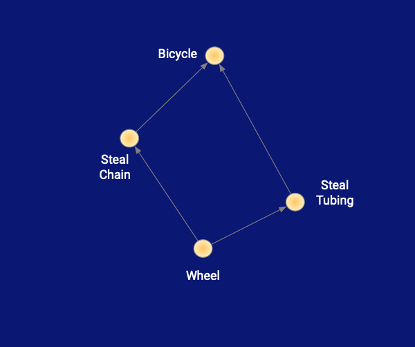
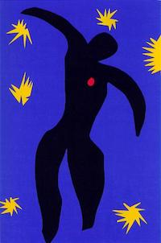
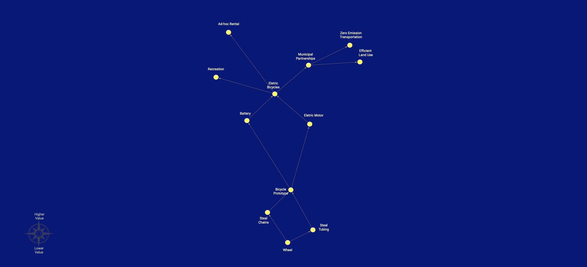

---
title: "Constellation DAGs"
date: 2019-01-09T00:00:00+00:00
anchor: "constellation-dagss"
weight: 10
---

A constellation DAG can be thought of as way to share the thought process that everyone already reasons through before making roadmaps or plans in general.

DAG refers to a *directed acyclic graph*, which is a graph with arrows connecting points on it to indicate direction, and if you follow the arrows you won’t end up going in a circle. In other words, at every point you don't need to think about more than the next step.

The constellation is reminiscent of laying out under the expanse of stars on a clear night and letting one's mind wander a bit, but not too much. Along with a slight haphazardness in the placement of the points further evokes a sense that we’re looking something that's imprecise, but still in the direction we want to go.

At the base of the graph we start with what is near and more known ideas, a feature, product or maybe just a core idea we want to build on.

Next as we go up in the sky, we build on the base adding point by answering the question *What do we need next?* With allowing for more vagueness as we go up in the sky.

Lastly the colors are important, with a dark blue sky contrasted with bold yellow pin points of light we show that this is a night sky free of distractions using Henri Matisse’s Icarus as inspiration. And with red we use to focus the readers attention on the points we are discussing. 

And our final look, from which we can then plan out a roadmap    with an overall awareness of our direction and options. 