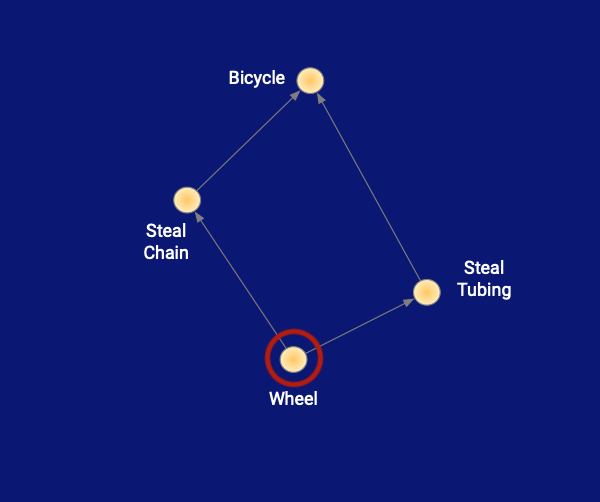
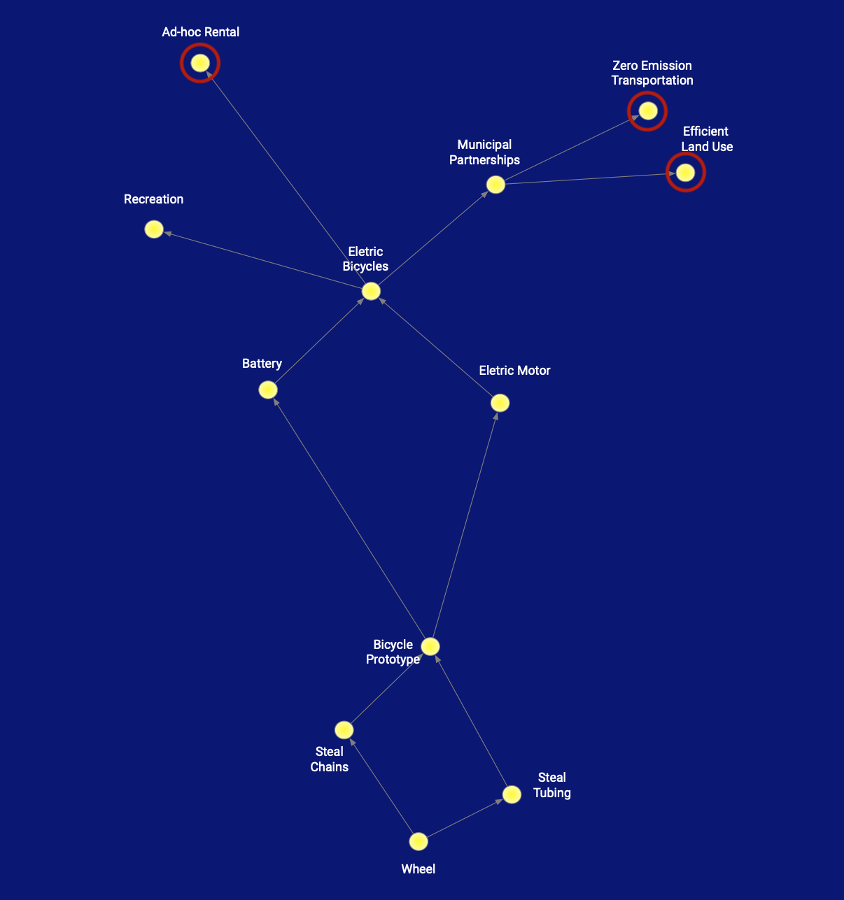
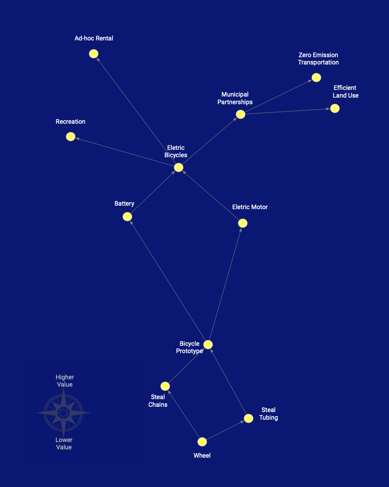

---
title: "Constellation DAGs"
date: 2019-01-09T00:00:00+00:00
anchor: "constellation-dagss"
weight: 10
---

A constellation DAG can be thought of as way to share the thought process that everyone already reasons through before making roadmaps or plans in general.

DAG refers to a *directed acyclic graph*, which is a graph with arrows connecting points on it to indicate direction, and if you follow the arrows you won’t end up going in a circle. In other words, at every point on the graph you can follow an arrow from it to the next point and not have to keep track of the points you’ve already visited to avoid going in circles. 

The constellation is reminiscent of laying out under the expanse of stars on a clear night and letting one's mind wander a bit, but not too much.

A slight haphazardnes in the placement of the points further evokes a sense that we’re looking at a constellation that is imprecise, points that are naturally occurring, but we see a form when the dots are connected.

At the base of the graph we start with what is near and more known ideas, a feature, product or maybe just a core idea we want to build on.

Next as we go up in the sky, we build on the base adding nodes by answering the question *What do we need next?* With allowing for more vagueness as we go up in the sky.

Lastly the colors are important, with a dark blue sky contrasted with bold yellow pin points of light we show that this is a night sky without hex codes or tricky color picking, thanks to Henri Matisse’s sense of color in Icarus.

And our final look, from which we can then plan out a roadmap    with an overall awareness of our direction and options. 